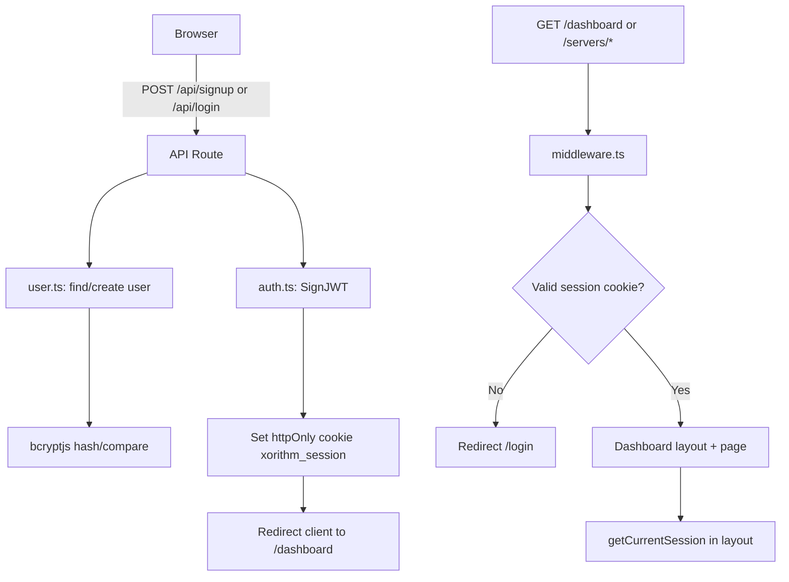

<!-- BEGIN:nextjs-agent-rules -->
# This is NOT the Next.js you know

This version has breaking changes — APIs, conventions, and file structure may all differ from your training data. Read the relevant guide in `node_modules/next/dist/docs/` before writing any code. Heed deprecation notices.
<!-- END:nextjs-agent-rules -->

# XOrithm Dashboard — Agent Guide

This document orients coding agents working in **XOrithm-Dashboard**: a Next.js 16 service-status dashboard with email/password auth and static server health data.

## Project summary

| Item | Value |
|------|-------|
| **Purpose** | Protected ops dashboard: sign up / log in, view mock server health (Up / Degraded / Down) |
| **Framework** | Next.js 16.2.4 (App Router), React 19, TypeScript |
| **Styling** | Tailwind CSS v4 (`src/app/globals.css`, CSS variables like `--app-bg`) |
| **Auth** | JWT in httpOnly cookie (`jose`), passwords hashed with `bcryptjs` |
| **Users DB** | Neon Postgres via `@neondatabase/serverless` when `DATABASE_URL` is set; else in-memory `Map` (local only) |
| **Server data** | Static array in `src/lib/servers.ts` — not persisted, not user-specific |
| **Production** | [https://ali-dashboard-xorithm.vercel.app/](https://ali-dashboard-xorithm.vercel.app/) |

## Repository layout

```text
XOrithm-Dashboard/
├── middleware.ts              # Route protection (reads session cookie)
├── src/
│   ├── app/
│   │   ├── page.tsx           # Public marketing landing (client component)
│   │   ├── layout.tsx         # Root layout, fonts, globals.css
│   │   ├── (auth)/            # Route group — no URL segment
│   │   │   ├── login/page.tsx
│   │   │   └── signup/page.tsx
│   │   ├── (dashboard)/       # Protected UI (layout also checks session)
│   │   │   ├── layout.tsx     # Header, user email, logout
│   │   │   ├── dashboard/
│   │   │   │   ├── page.tsx   # Server table + filters (URL query state)
│   │   │   │   └── loading.tsx
│   │   │   └── servers/[id]/
│   │   │       ├── page.tsx   # Server detail view
│   │   │       └── loading.tsx
│   │   └── api/
│   │       ├── login/route.ts
│   │       ├── signup/route.ts
│   │       └── logout/route.ts
│   ├── Components/            # Note: capital C (project convention)
│   │   ├── auth-form.tsx      # Client — login/signup form
│   │   ├── server-table.tsx
│   │   ├── server-filters.tsx
│   │   ├── status-badge.tsx
│   │   ├── logout-button.tsx
│   │   └── skeleton.tsx
│   └── lib/
│       ├── auth.ts            # JWT create/verify, cookie name
│       ├── session.ts         # getCurrentSession, getSessionFromRequest
│       ├── user.ts            # findUserByEmail, createUser (DB or memory)
│       ├── db.ts              # Neon client + users table bootstrap
│       ├── servers.ts         # Static data, getServers, getServerById
│       └── validators.ts      # Zod schemas (defined but not wired to API yet)
├── scripts/schema.sql         # Reference SQL for users table
├── .env.example
└── Dashboard-app-demo/        # Older demo copy — EXCLUDED from tsconfig; do not edit unless asked
```

**Path alias:** `@/*` maps to repo root (see `tsconfig.json`). Imports look like `@/src/lib/auth`.

## How to run locally

```bash
npm install
cp .env.example .env.local   # Windows: copy .env.example .env.local
# Set AUTH_SECRET (required for production; dev falls back to a hardcoded default in auth.ts)
# Optional: DATABASE_URL for Neon Postgres
npm run dev                  # http://localhost:3000
```

If Turbopack misbehaves after large changes: delete `.next` and restart, or `npm run dev:webpack`.

**Scripts:** `dev`, `dev:webpack`, `build`, `start`, `lint`.

## Environment variables

| Variable | Required | Description |
|----------|----------|-------------|
| `AUTH_SECRET` | Production yes | Secret for signing JWT session tokens. Generate: `node -e "console.log(require('crypto').randomBytes(32).toString('hex'))"` |
| `DATABASE_URL` | Recommended | Neon/Postgres connection string. Without it, users live in memory and are lost on server restart / cold starts on Vercel. |

Never commit `.env.local`. Vercel needs both vars under Project → Settings → Environment Variables.

## Request / auth flow



### Session details

- **Cookie name:** `xorithm_session` (`SESSION_COOKIE_NAME` in `src/lib/auth.ts`)
- **JWT payload:** `{ sub, email, name }`, HS256, 1-day expiry in token; cookie `maxAge` is 30 days
- **Middleware** (`middleware.ts`): protects paths starting with `/dashboard` and `/servers`
- **Layout guard** (`(dashboard)/layout.tsx`): also calls `getCurrentSession()` and `redirect("/login")` — defense in depth
- **Logout:** `POST /api/logout` clears cookie with matching path/options

## Routes reference

| Path | Access | Type | Notes |
|------|--------|------|-------|
| `/` | Public | Client page | Marketing landing |
| `/login` | Public | Server page + `AuthForm` | |
| `/signup` | Public | Server page + `AuthForm` | |
| `/dashboard` | Protected | Server Component | Query: `?status=All\|Up\|Degraded\|Down&sort=name-asc\|...` |
| `/servers/[id]` | Protected | Server Component | 404 if id not in static list |
| `POST /api/login` | Public | Route handler | JSON `{ email, password }` |
| `POST /api/signup` | Public | Route handler | JSON `{ name, email, password }` |
| `POST /api/logout` | Protected* | Route handler | Clears session (*no middleware block, but typically called when logged in) |

## Data layer

### Users (`src/lib/user.ts` + `src/lib/db.ts`)

- Postgres path: `ensureUserSchema()` runs `CREATE TABLE IF NOT EXISTS users (...)` once per process
- Email stored lowercase; unique constraint on email (Postgres error `23505` → 409 on signup)
- In-memory fallback: `Map<string, User>` keyed by lowercase email

### Servers (`src/lib/servers.ts`)

- Five mock servers (`srv-1` … `srv-5`)
- `getServers({ status, sort })` filters and sorts in memory
- `getServerById(id)` for detail page
- **To add live data:** replace or wrap this module; dashboard pages already consume `ServerRecord[]`

## UI conventions

- **Server Components by default**; add `"use client"` only when needed (forms, router hooks, interactivity)
- **Components folder** uses PascalCase path: `src/Components/` (not `components/`)
- **Design tokens** in `globals.css`: `bg-app-bg`, `text-app-fg`, `app-accent`, `app-muted`, etc.
- **Status badges:** `StatusBadge` maps Up / Degraded / Down to colors
- **Filters:** `ServerFilters` uses `<Link>` with query strings — state is URL-driven (shareable, refresh-safe)

## Next.js 16 specifics (read before changing routes)

- **`searchParams` and `params` are Promises** in page components — always `await searchParams` / `await params` (see dashboard and server detail pages)
- **`cookies()` from `next/headers` is async** — use `await cookies()` in route handlers and server code
- Consult `node_modules/next/dist/docs/` for deprecations; do not assume Next.js 14/15 patterns

## Common agent tasks

### Add a new protected page

1. Add under `src/app/(dashboard)/your-page/page.tsx`
2. If path is outside `/dashboard` and `/servers`, add prefix to `protectedRoutes` in `middleware.ts`

### Wire real server API

1. Extend or replace `src/lib/servers.ts` with fetch logic (consider Server Component `async` data loading)
2. Keep `ServerRecord` shape or update `ServerTable` / detail page types together
3. Add loading/error UI under `(dashboard)/` as needed

### Harden auth API

- `src/lib/validators.ts` has Zod schemas but **`zod` is not in `package.json`** and routes validate manually today — if using validators, add `zod` dependency and import in login/signup routes

### Do not

- Edit `Dashboard-app-demo/` unless explicitly requested (excluded from TypeScript project)
- Commit secrets or `.env.local`
- Store sessions in `localStorage` (project standard is httpOnly cookies)
- Assume server CRUD exists in this repo — demo folder has CRUD variant; **this root app is read-only mock data**

## Dependencies worth knowing

| Package | Usage |
|---------|--------|
| `next`, `react`, `react-dom` | App framework |
| `jose` | JWT sign/verify |
| `bcryptjs` | Password hashing (`bcrypt` is listed but unused — prefer `bcryptjs` only) |
| `@neondatabase/serverless` | Postgres when `DATABASE_URL` set |
| `tailwindcss`, `@tailwindcss/postcss` | Styling v4 |

## Testing checklist (manual)

1. `/` loads landing; links go to login/signup
2. Sign up → lands on `/dashboard` with session cookie
3. Filter by status and sort — URL updates, table reflects changes
4. Click server name → `/servers/srv-*` detail
5. Logout → session cleared; `/dashboard` redirects to login
6. With `DATABASE_URL`: user persists across dev server restart; without: in-memory only

## Related files

- Human-oriented setup: `README.md`
- DB schema reference: `scripts/schema.sql`
- Claude/Cursor pointer: `CLAUDE.md` → `@AGENTS.md`
